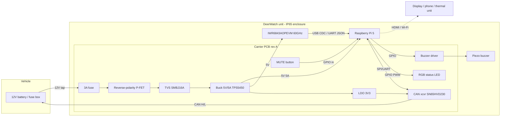
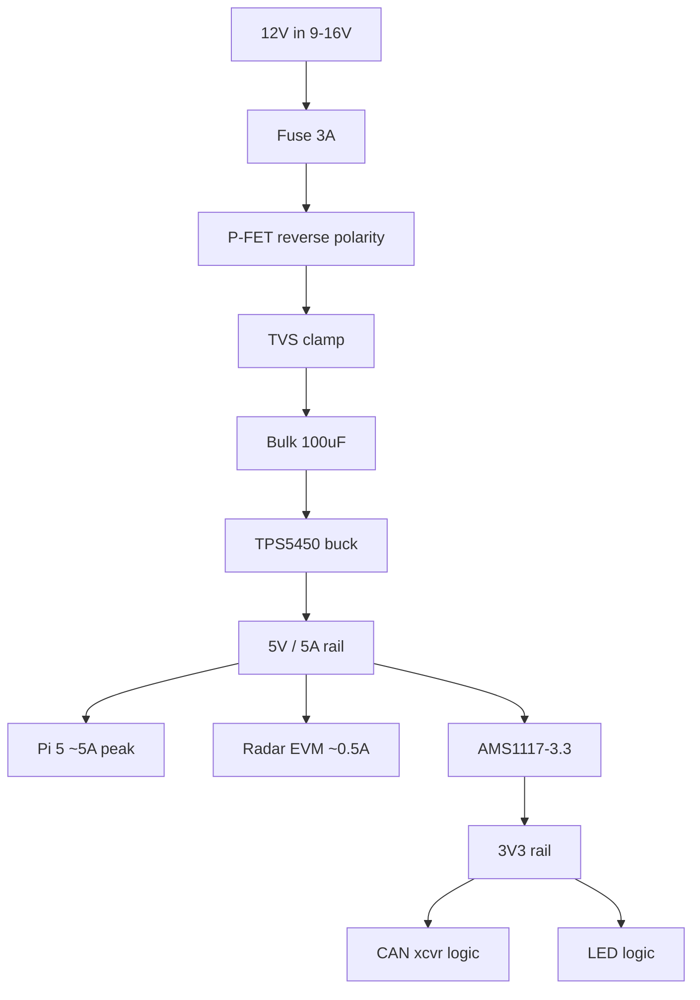
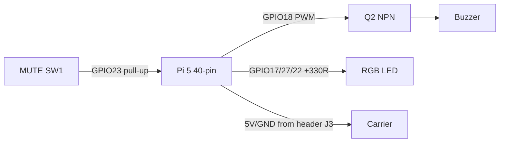
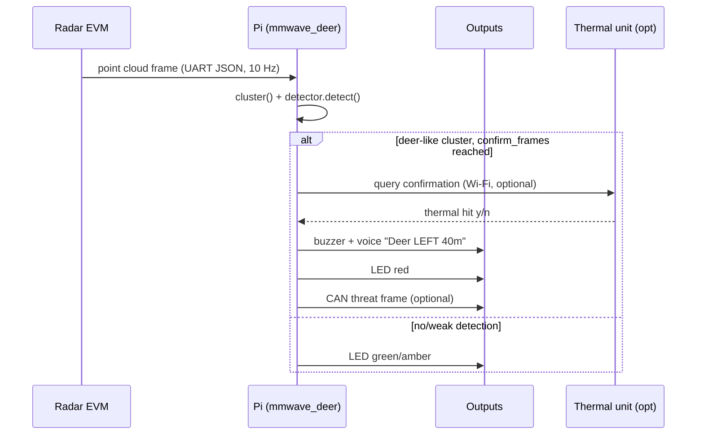
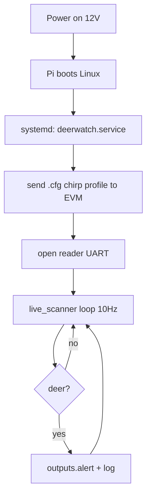

# Integration Diagrams

Mermaid diagrams render on GitHub. Source-of-truth wiring for the prototype build.

---

## 1. System block diagram

---

## 2. Power tree

---

## 3. Raspberry Pi 5 GPIO assignment (BCM numbering)

| Signal | BCM | Pin | Direction | Notes |
|--------|-----|-----|-----------|-------|
| Buzzer | GPIO18 | 12 | out (PWM) | via MMBT2222A driver Q2 |
| LED R | GPIO17 | 11 | out | 330R -> RGB R |
| LED G | GPIO27 | 13 | out | 330R -> RGB G |
| LED B | GPIO22 | 15 | out | 330R -> RGB B |
| MUTE btn | GPIO23 | 16 | in (pull-up) | tactile SW1 to GND |
| CAN TX | GPIO (UART/SPI) | per HAT | out | SN65HVD230 or MCP2515 HAT |
| CAN RX | GPIO | per HAT | in | |
| 5V | - | 2,4 | power | from carrier buck |
| GND | - | 6,9,14,20,25,30,34,39 | gnd | |

---

## 4. Wiring / connector map

| Connector | On | Mates to | Pins |
|-----------|----|---------|------|
| J1 | Carrier | 12V fuse-tap harness | +12V, GND |
| J2 | Carrier | Vehicle CAN (optional) | CANH, CANL, GND |
| J3 | Carrier | Pi 5 40-pin header | 2x20 |
| J4 | Carrier | Radar EVM USB/UART | 5V, GND, RX, TX |
| BZ1 | Carrier | Piezo buzzer | +, - |
| USB | Pi | Radar EVM micro-USB | data |

---

## 5. Detect -> alert sequence

---

## 6. Boot / runtime

